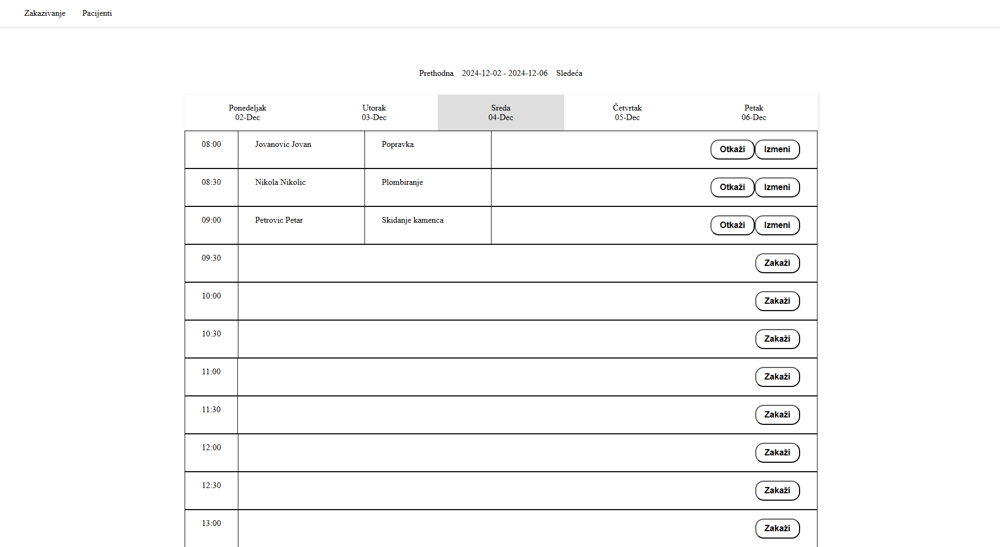

# 🗓️ Doctor's Office Scheduling App

A PHP-based application designed to simplify appointment scheduling and patient management for a doctor's office. Built using object-oriented programming (OOP) principles, the app ensures modularity, maintainability, and efficiency.

## 🚀 Features

### Appointments
- View all appointments for a specific day.
- Check available slots for new appointments.
- Navigate between days or weeks with easy-to-use controls.
- Cancel or update existing appointments:
  - Reschedule to a different time on the same day.
  - Change the day and select a new time from the available slots.

### Patients
- View a comprehensive list of all patients in the database.
- Search for patients by name.
- View detailed patient information, including:
  - Personal details.
  - History of previous and upcoming appointments.
- Update patient information.

## 🧰 Tech Stack

- **Language**: PHP
- **Database**: MySQL (or your preferred relational database)
- **Architecture**: Object-Oriented Programming (OOP)
- **Styling**: CSS

## 🛠 Installation and Usage

### Prerequisites
Ensure you have the following installed:
- [PHP](https://www.php.net/) (>=7.4 recommended)
- [MySQL](https://www.mysql.com/) or compatible database
- A web server like [Apache](https://httpd.apache.org/) or [Nginx](https://nginx.org/)

### Installation
1. Clone the repository:
   ```bash
   git clone https://github.com/your-username/doctor-scheduling-app.git

## 🖼 Screenshots/Demo

### Appointments Page


### Patients Page


